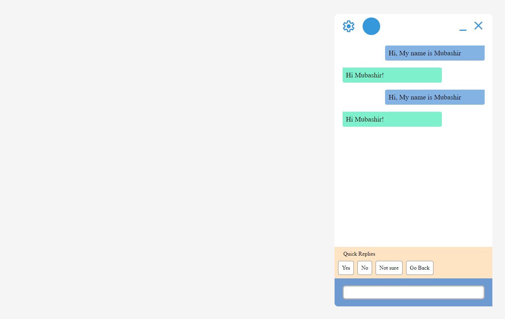

# Robust Chatbot Interface using HTML, CSS and javascript

## Overview

This is a simple chatbot frontend implementation using plain HTML, CSS, and JavaScript.

## Purpose

 This chatbot is designed to seamlessly integrate into various website frontends, providing a customizable and adaptable solution. With a range of basic to advanced functionalities, the chatbot is developed with clear and easily understandable code, making it accessible for both beginners and experienced developers.

## Screenshots

